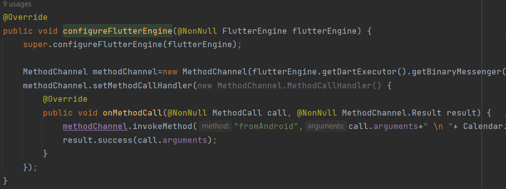
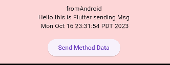
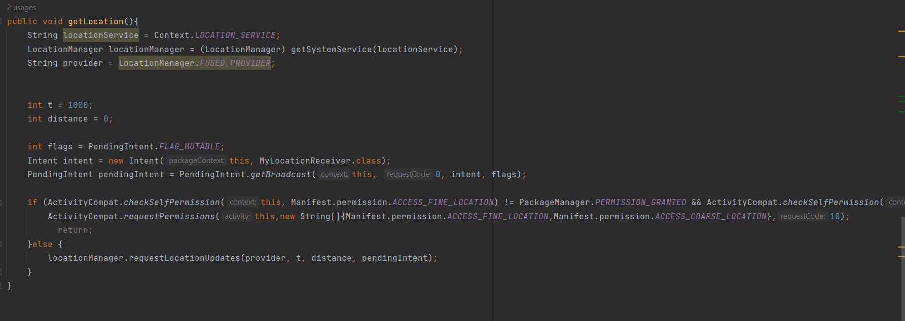
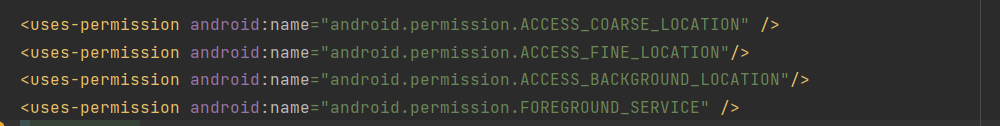
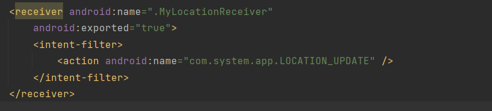
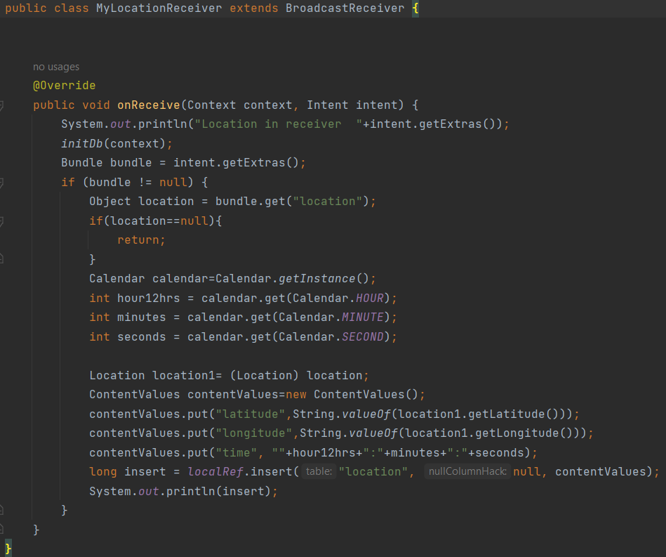
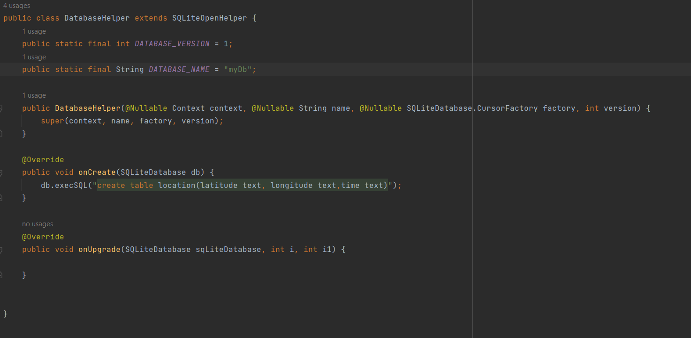
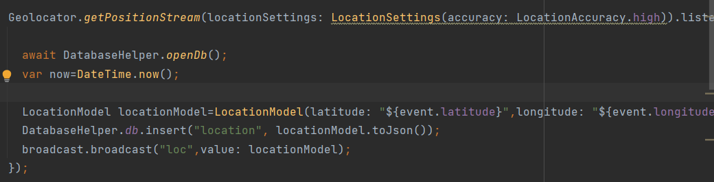
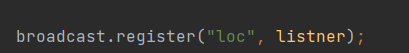

# enterslice

technical round.

## Getting Started

This project is a starting point for a Flutter application.

A few resources to get you started if this is your first Flutter project:

- [Lab: Write your first Flutter app](https://docs.flutter.dev/get-started/codelab)
- [Cookbook: Useful Flutter samples](https://docs.flutter.dev/cookbook)

For help getting started with Flutter development, view the
[online documentation](https://docs.flutter.dev/), which offers tutorials,
samples, guidance on mobile development, and a full API reference.

## Create Method channel from flutter 
MethodChannel methodChannel=MethodChannel("flutter");

## invoke method
methodChannel.invokeMethod("method","Hello this is Flutter sending Msg").then((value){
Fluttertoast.showToast(msg: "Successful");
});

## on android native side
@Override
public void configureFlutterEngine(@NonNull FlutterEngine flutterEngine) {
super.configureFlutterEngine(flutterEngine);

MethodChannel methodChannel=new MethodChannel(flutterEngine.getDartExecutor().getBinaryMessenger(),"flutter");
methodChannel.setMethodCallHandler(new MethodChannel.MethodCallHandler() {
    @Override
    public void onMethodCall(@NonNull MethodCall call, @NonNull MethodChannel.Result result) {
        methodChannel.invokeMethod("fromAndroid",call.arguments+" \n "+ Calendar.getInstance().getTime().toString());
        result.success(call.arguments);
    }
    });
}

## click on Send Method Data to send and receive data from android native side

## from location get in background from android native

## permission in menifest

## add receiver in manifest

## create class  MyLocationReceiver and  extends to BroadcastReceiver

## for database creation in android 

## getting location and send to broadcast 

## listen to incoming broadcast

